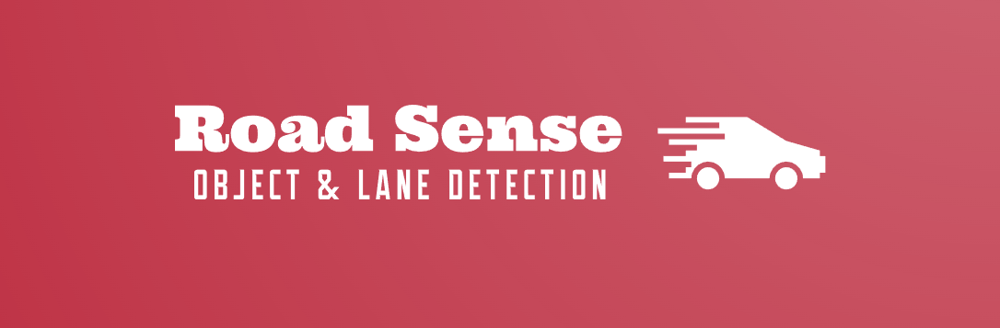
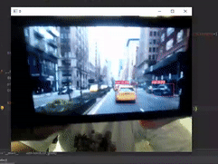

<h1 align="center">

</h1> 

# Road Sense
Real time object detection and lane detection for autonomous cars using YOLO (You Only Look Once) and ultra-fast lane detection techniques.

## 🔑 Key Feature
- Automated custom object detection
- Automated lane detection
- Can work in real time on low quality webcams

## 💻 Sample Output
### Custom Data labelling:

### Working on Dashcam:

### Working on 1080p footage in realtime:

## 🛠 Skills
Python , Computer Vision , Deep Learning , Yolo models, Cutom dataset creation for object detection.

## 📖 Libraries Used
Yolo, OpenCV, TensorFlow, PyTorch, and CUDA

## 📃 Lessons Learnt

- Learning to label a custom dataset for object detection
- Creating a real time object detection system
- Coupling real time object detection with lane detection
- Code optimization

## 🔮 Future Scope

- Connecting code to IOT device thats attached to a dashcam
- Creating a plug and play, smart dashcam device
